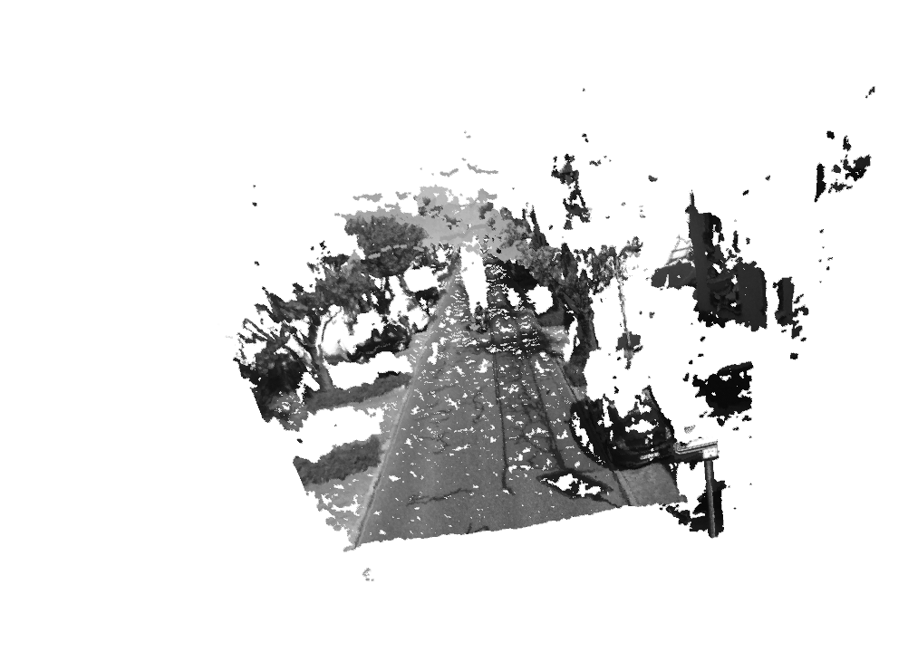
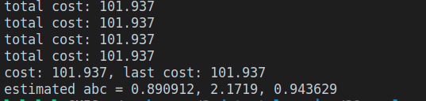

<!--
 * @Author: Liu Weilong
 * @Date: 2021-02-06 22:52:42
 * @LastEditors: Liu Weilong
 * @LastEditTime: 2021-02-08 08:37:23
 * @Description: 
-->
### 1. 图像去畸变
最终结果:

### 2. 双目视差
最终结果:

### 3. 矩阵微分
1. 
$$
    \frac{dAx}{dx} = A
$$
2. 
$$
    \frac{dx^TAx}{dx} = 2A
$$
3. 
$$
    x^TAx = tr(Axx^T)
    Ax = \left[
        \begin{matrix}
        a_1 &a_2 &a_3
        \end{matrix}
        \right]
        \left[
        \begin{matrix}
        x_1 &x_2 &x_3
        \end{matrix}
        \right]
        = a_1x_1 +a_2x_2+a_3x_3
    \\
    Axx^T
$$

时间不足，没有想到证明方法

### 4. GN 优化
最终结果:

### 5. 批量估计
1. 给出H的具体形式
$$
    x_3 = x_2 +v_3\\
    x_2 = x_1 +v_2\\
    x_1 = x_0 +v_1\\
    y_3 = x_3 \\
    y_2 = x_2 \\
    y_1 = x_1 \\
    H= \left[
        \begin{matrix}
            -1&1&0&0\\
            0&-1&1&0\\
            0&0&-1&1\\
            0&1&0&0\\
            0&0&1&0\\
            0&0&0&1\\
        \end{matrix}
    \right]
$$
2. W的具体数值
$$
    W= \left[
        \begin{matrix}
            Q^{-1}&0&0&0&0&0\\
            0&Q^{-1}&0&0&0&0\\
            0&0&Q^{-1}&0&0&0\\
            0&0&0&R^{-1}&0&0\\
            0&0&0&0&R^{-1}&0\\
            0&0&0&0&0&R^{-1}\\
        \end{matrix}
    \right]
$$
3. 存在唯一解，因为
   $$
    H^TWH
   $$
   满秩

