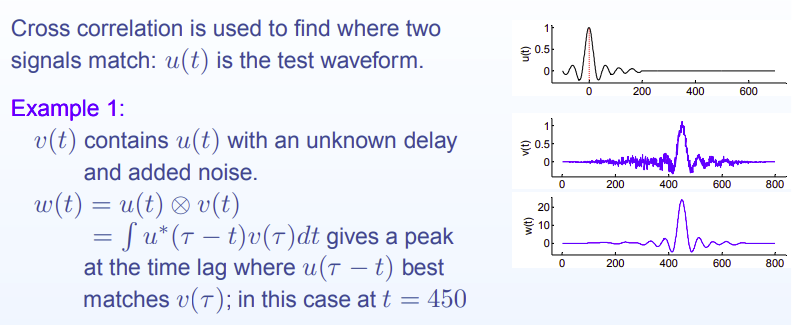

<!--
 * @Author: Liu Weilong
 * @Date: 2021-05-25 21:29:54
 * @LastEditors: Liu Weilong
 * @LastEditTime: 2021-05-27 08:19:52
 * @Description: 
-->
### 梗概

1. Cross-Correlation 
2. Signal-Matching
3. Cross-corr as Convolution
   
----

1. Cross-Correlation

   两个信号之间的 cross - correlation 定义:
   $$
    \omega(t)  = u(t) \star v(t) = \int^{\infin}_{-\infin}u^*(\tau) v(\tau+t)d\tau
    \\
    = \int^{\infin}_{-\infin}u^*(\tau-t) v(\tau)d\tau
   $$
   cross - correlation 用来找如何让那个两个信号match

2. Signal Matching

   一个如何应用的例子

   