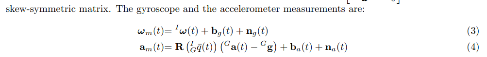

<!--
 * @Author: Liu Weilong
 * @Date: 2021-04-21 09:02:07
 * @LastEditors: Liu Weilong 
 * @LastEditTime: 2021-04-22 11:01:12
 * @FilePath: /Codes/30. supplement_material/observability_analysis/basic_observability.md
 * @Description: 
-->
### 目的
说明白
1. 可观性的定义 见补充
2. 可观性的意义 见补充
3. 维护零空间的目的 见 5.

### 梗概
主要内容来自
1. Aided Inertial Navigation With Geometric Features: Observability Analysis
2. Consistency Analysis and Improvement of Vision-aided Inertial Navigation 更加详细一些
3. 一文看尽系列 https://zhuanlan.zhihu.com/p/341322063
4. Consistency of EKF-Based Visual-Inertial Odometry limingyang 大佬牛逼

tips： 需要找几个例子，对于这个问题进行验证

-----
状态量:

1. 转移矩阵
   
   
   
2. 观测
   
   

   观测线性化:
   
   这里存在的右半部分是因为存在一个点坐标系的转换：
   
   
From 2.IV. VINS OBSERVABILITY ANALYSIS
3. 局部可观性矩阵:Local observability matrix and its
application to observability analyses
$$
    M(x^{\star})=\left[
        \begin{matrix}
            H_1 \\
            H_2\Phi_{(2,1)}\\
            H_3\Phi_{(3,1)}\\
            H_4\Phi_{(4,1)}\\
            ...\\
            H_k\Phi_{(k,1)}
        \end{matrix}
        \right]
        \\
       \Phi_{(k,1)} =  \Phi_{(k,k-1)}\Phi_{(k-1,k-2)}...\Phi_{(3,2)}\Phi_{(2,1)}
$$
$\Phi$ 为离散状态转移矩阵，$H_k$ 为k时刻的观测矩阵,这里可以提前转换好，也可以根据下列代码进行转化

4. 关于各个状态可观性的判断:
    PWCS+SVD的判断方式

5. WHY 零空间维护？
   因为从上面的结论看过来,零空间的维数直接和状态是否可观有联系，如果出现零空间减少的情况，必然会出现求解有误差的问题
   FEJ OC DSO 见 supplement_material/observability_analysis/fej.md oc.md dso.md
   其实，讨论的问题是如何让离散化，尽可能少的引入误差

-----
### 补充
1. 可观性理论补充
   理论目的:
   检验能否从观测推导得到 ，状态初始值$x_0$,因为有了初始值，就可以再根据状态转移方程，得到所有时间的状态初始值。
   这样通过一定的观测，得到所有的状态量值，所以就说系统是可观的了。
   
   
   
   
   只有可观性矩阵满秩，才能让$x_0$ 唯一
2. VINS on Wheel的状态分析
   Unobservable Directions of VINS Under Special Motions 
   有关于零空间方面的分析，
   对于一些特殊运动情况的可观性进行了分析。

   但是，如果想要确实进行分析，就还是需要PWCS+SVD的方法
   

