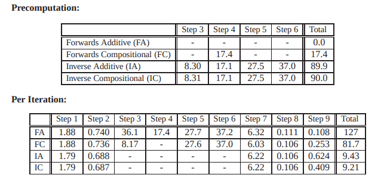
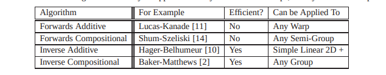
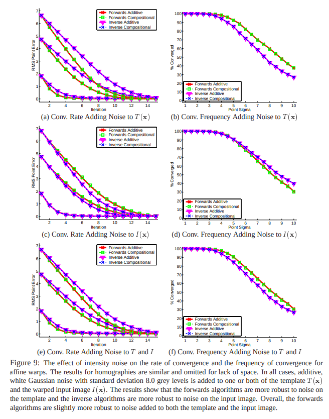

<!--
 * @Author: Liu Weilong
 * @Date: 2021-02-02 15:44:46
 * @LastEditors: Liu Weilong 
 * @LastEditTime: 2021-02-24 10:07:29
 * @FilePath: /3rd-test-learning/30. supplement_material/optical_flow/theory.md
 * @Description: 
-->
### 光流法解读
1. 关键名词解释 
a. W() -> Warp 对点进行一次小变换 
   小patch可以用平移Warp
   $$
   W_{trans}(x;p) = \left[\begin{matrix}
   x+p_1\\
   y+p_2
   \end{matrix}\right]
   $$
   对于大patch我们考虑进行affine 进行匹配
   $$
   W_{affi}(x;p) = \left[\begin{matrix}
   1+p_1&p_3&p_5\\
   p_2&1+p_4&p_6
   \end{matrix}\right]
   \left[\begin{matrix}
   x\\
   y\\
   1
   \end{matrix}\right]
   $$

以下我们主要考虑 W(x;p)是一个Ax 的线性关系,A是一个每个像素都和p相关的矩阵 
b. template(patch) 
   一般是一个小方格，
   $$
   T_{3×3}(x)=
   \left[\begin{matrix}
   x\\
   y\\
   1
   \end{matrix}\right]+
   \left[\begin{matrix}
   c\\
   d\\
   0
   \end{matrix}\right]\\
   c,d\in{-1,0,1}
   $$
c. Inverse  
d. Composition 

1. 算法 

a. 原版本的更新 
$$
    \underset{\Delta{p}}{\operatorname{argmin}}\sum_T[I(W(x;p+\Delta{p}))-T(x)]^2\\
    p\leftarrow{p+\Delta{p}}
$$
b. Warp Update版 
$$
    \underset{\Delta{p}}{\operatorname{argmin}}\sum_T[I(W(W(x;\Delta{p});p+\Delta{p}))-T(x)]^2\\
    W(x;p)\leftarrow{W(W(x;\Delta{p});p)}
$$
c. a和b的等价性 
先是a的线性化求解
$$
\begin{aligned}
    &\sum_T[I(W(x;p+\Delta{p}))-T(x)]^2\\
    =&\sum_T[I(W(x;p))+\cfrac{\partial{I}}{\partial{W}}\cfrac{\partial{W}}{\partial{p}}\Delta{p}-T(x)]^2
\end{aligned}
$$
再是b的线性化求解
$$
\begin{aligned}
&\sum_T[I(W(W(x;\Delta{p});p+\Delta{p}))-T(x)]^2\\
=&\sum_T[I(W(W(x;0);p))+\cfrac{\partial{I}}{\partial{W(x;p)}}\cfrac{\partial{W(x;p)}}{\partial{x}}\cfrac{\partial{W(x;p)}}{\partial{p}}\Delta{p}]^2
\end{aligned}
$$
两式不同的地方是在
$$
    \cfrac{\partial{W}}{\partial{p}}\leftarrow{\cfrac{\partial{W(x;p)}}{\partial{x}}\cfrac{\partial{W(x;p)}}{\partial{p}}}
$$

这里可以证明只要Warp 可以逆就存在这样一个关系 
进而引出，只要Warp 是一个群就存在这样的一个关系 

d. Inverse Compositional版本
$$
\begin{aligned}
    &\sum_T[I(W(W(x;\Delta{p});p+\Delta{p}))-T(x)]^2
    \\&\downarrow W(x;\Delta{p})=y
\\ =& \sum_{W(T(x);p)}[I(W(y;p))-T(W^{-1}(y;\Delta{p}))]^2
\end{aligned}
\\
W(x;p)\leftarrow{W(x;p)\circ{W^{-1}(x;\Delta{p})}}

$$
------
方便理解的版本 
原问题可以转换成一个简单的例子 
$$
    \sum^{10}_{x=0} (x^2+1)\\
    \downarrow + \; y=x^2\\
    \sum^{a}_{y=b} (y+1)
$$
现在问题就是a和b是什么的问题 
$$
    y=x^2=f(x)\\
    f^{-1}(x) =\sqrt{x}\\
    a=f^{-1}(10)\\
    b=f^{-1}(0)
$$

---------

这里也是证明了只要W是一个群就可以为所欲为。

2021.2.23 更新 
在阅读论文 光流20年的时候大概知道了，
真正的公式推导应该是
$$
    \underset{T}{\sum} I(W(W(x;\Delta{p});p))-T(x)
\\
\downarrow y=W(x;\Delta p)
\\
\underset{W(T;\Delta p)}{\sum} I(W(y;p)) - T(W^{-1}(y;\Delta p))
\\
\downarrow \Delta p \rightarrow 0, W(x;\Delta p) = x
\\
\underset{T}{\sum} I(W(y;p)) - T(W^{-1}(y;\Delta p)) 
$$
至于为什么差了一个符号，还可以在直接法当中使用？
因为存在
$$
    W^{-1}(x;\Delta p) = W(x;-\Delta p)
$$
这个值$\Delta p$可以在更新的时候换一个正负号就可以补上。 
所以可以写成如下的形式

$$
    \underset{p}{argmin}\sum[I(W(x;p))-T(W(x;\Delta{p}))]^{2}
    \\
    W(x;p) =\pi{(\exp(p)x)}
$$

进一步进行拓展： 
四种方法耗时： 

四种方法Warp的条件： 

四种方法对于噪声的鲁棒性: 

最后的结论是，Forward method 虽然耗时要大得多，但是对于噪声会更加鲁棒。