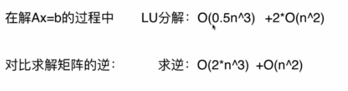
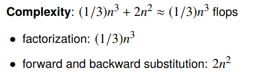

<!--
 * @Author: Liu Weilong
 * @Date: 2021-01-25 13:19:02
 * @LastEditors: Liu Weilong 
 * @LastEditTime: 2021-01-25 18:09:11
 * @FilePath: /3rd-test-learning/30. supplement_material/solution_of_linear_equation/doc.md
 * @Description: 
-->
reference:https://zhuanlan.zhihu.com/p/54943042 LU分解 

1. LU 分解 
   条件： 
   a. 方阵 b. 可逆 c.消元过程中没有0主元出现 
   作用： 
   加速 $Ax=b$计算 
   $$
    Ax=b\\
    LUx=b\\
    Ly=b\\
    Ux=y
   $$
   对比求逆的解法 
   
   变种： 
   $PA = LU$ 克服 c  条件 0主元的情况，需要对A进行一次换行 然后重新计算 
   
2. Cholesky分解 
   条件: 
   a. 正定 b. 对称 
   作用: 
   加速$Ax=b$计算 
   $$
   Ax=b\\
   LL^T=b\\
   Ly=b\\
   L^Tx=y
   $$
   时间复杂度: 
   
   $O(\frac{1}{3}n^3)$

3. QR 分解 
   条件： 
   
   