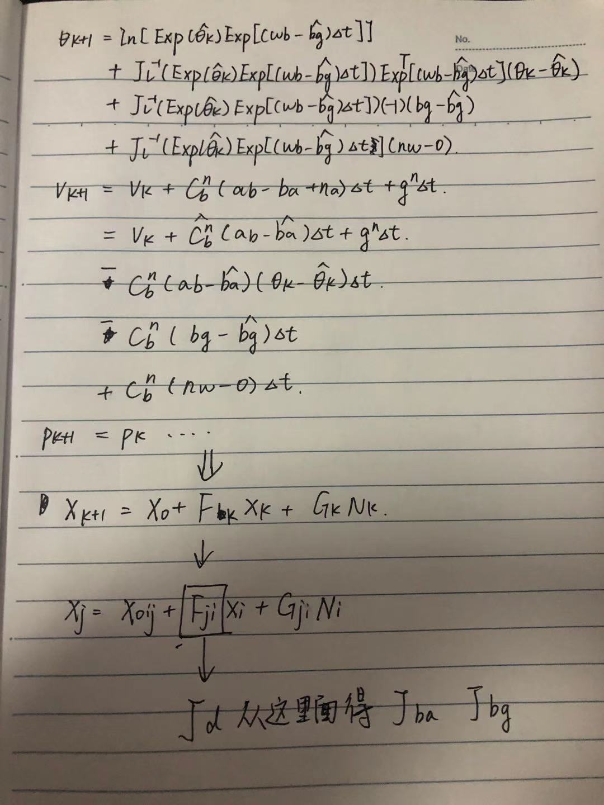

<!--
 * @Author: Liu Weilong
 * @Date: 2020-12-27 13:12:44
 * @LastEditors: Liu Weilong
 * @LastEditTime: 2021-04-07 07:35:41
 * @FilePath: /3rd-test-learning/doc/SLAM-related/VINS_Mono/Theory.md
 * @Description: 
-->
## VINS关于预积分的Ba Bg 变化的情况

关于$J_{ba}$ 和 $J_{bg}$的问题，在这里得到了解释。 
之前对于$J_{ba}$ 和 $J_{bg}$ 的理解存在一些问题。 
主要是因为  
     1. 预积分递推有一个用于迭代的J  
         2. 方差估计使用误差分析的时候还有一个迭代的J(部分文档) 
存在多个J 的情况下，有些时候会搞混。这里就是很明显的说明了，
$J_{bg}$和$J_{ba}$都是来自于预积分递推的J。如上图所示。 
每一个IMU 数据的递推 
$X_{k+1} = F_kX_{k} + G_{k}N_{k}$ 
$J_{k+1} = F_{k}J_k$  
最后一个IMU预积分 
$X_{j} = J_{ji}X_{i} + G_{ji}N_i$ 
$X_{k+1} = f(X_k,u,n)$ 
$X_{k+1} = f_0 + J_{X_k}(X_k-\hat{X_k})+J_{u}(u)+J_{n}(n)$ 
$J_{ji} =J_{X_k}$ 
由此，我们就可以知道 
$J_{bg}$和$J_{ba}$ 都是来自$J_{ji}$ 
2020.12.24添加 具体说明一下$J$
$$
\begin{aligned}
X_{k+1} &= f_{k}(X_{k},b_{k})\\
X_{k+1} &= \hat{(f_{k}(\hat{X_{k}},\hat{b_{k}}))} + J^{f_k}_{X_{k}}(X_k - \hat{X_k}) + J^{f_k}_{b_k}(b_k-\hat{b_k})\\
X_{k+2} &= f_{k+1}(X_{k+1},b_{k+1})\\
X_{k+2} &= \hat{(f_{k+1}(\hat{X_{k+1}},\hat{b_{k+1}}))} + J^{f_{k+1}}_{X_{k+1}}(X_{k+1} - \hat{X_{k+1}}) + J^{f_{k+1}}_{b_{k+1}}(b_{k+1}-\hat{b_{k+1}})\\
X_{k+2} &= \hat{(f_{k+1}(\hat{X_{k+1}},\hat{b_{k+1}}))} \\&+ J^{f_{k+1}}_{X_{k+1}}[\hat{(f_{k}(\hat{X_{k}},\hat{b_{k}}))} + J^{f_k}_{X_{k}}(X_k - \hat{X_k}) + J^{f_k}_{b_k}(b_k-\hat{b_k}) - \hat{X_{k+1}}]\\ &+ J^{f_{k+1}}_{b_{k+1}}(b_{k+1}-\hat{b_{k+1}})
\\
b_{k+1} &= b_k\\
J^{X_{k+2}}_{b_k} &=J^{f_{k+1}}_{X_{k+1}}( J^{f_k}_{b_k}(b_k-\hat{b_k}))+ J^{f_{k+1}}_{b_{k+1}}(b_{k}-\hat{b_{k}})\\
 &=J^{X_{k+2}}_{X_{k+1}}( J^{X_{k+1}}_{b_k}(b_k-\hat{b_k}))+ J^{X_{k+2}}_{b_{k+1}}(b_{k}-\hat{b_{k}})
 \\
 &=( J^{X_{k+2}}_{b_k}(b_k-\hat{b_k}))+ J^{X_{k+2}}_{b_{k+1}}(b_{k}-\hat{b_{k}})
\end{aligned}
$$

这里就可以发现，通过不断迭代我们最终可以找到一个不是近似的$J^{X}_b$

2021.2.10 添加\
加入 IMU Jacobian 更新部分的讨论,算是一种近似\
这里讨论$\alpha$ 为例,忽略掉了白噪声\
$$
    \alpha_{k+1} = f(\alpha_k,b)
    \\
    \alpha_{k+1} = f_0 + F_{\alpha}(\alpha_k - \hat{\alpha_k}) + J_{b}(b-\hat{b})
    \\
    \alpha_{k+1} + \delta{\alpha_{k+1}} = f_0 + F_{\alpha}(\alpha_k - \hat{\alpha_k}) + J_{b}(b-\hat{b})+F_{\alpha}\delta{\alpha_{k}} +  J_{b}\delta{b}
    \\
     \delta{\alpha_{k+1}} = 
    F_{\alpha}\delta{\alpha_{k}} +  J_{b}\delta{b}
$$
最后发现 $\delta{X}$ 的 $F$ 和 $X(State)$ 的 $F$ 等价\
迭代的时候就可以直接 J = FJ了 和 论文一致\
解决了之前一直困扰的 为什么 J_b 的更新一直使用 \deltaX 的 F 的问题\

 
IMU 在更新的时候，存在一个逆向的过程，也就是 F从误差状态当中得到的。但是因为等价的原因，就可以用在之后优化的过程中
 

2020.12.25 添加 
在阅读代码的时候发现实际上，一开始担心的雷，也就是每一次涉及到Bias 的线性化，IMU都要重新进行预积分的事情
 
在代码的时间编写的时候，是把Bias限制在了一个点上，然后Bias变量进行不断的变化。 
这里的意思是这样的 

2021.4.1添加 
这是一种降精度近似的方法

$$
    r_{\theta_{bjbi}}=In[R_j^TR_iexp(\theta_{b_jb_i}+J^{\theta_{b_jb_i}}_{b_{gi}}(b_{gbi}-{b^{linearized}_{gbi}}))]
$$

这里的$J^{\theta_{b_jb_i}}_{b_{gi}}$ 只是和$b^{linearized}_{gbi}$ 有关, $b_{gbi}$ 当一个和$J$ 无关的变量进行处理。 
好处肯定是减少计算量，但是从上面的推导可以看出来，其实 $J^{\theta_{b_jb_i}}_{b_{gi}}$ 是和 $b_{gbi}$ 有关的，这里只是固定了线性化点。  如果真的要较真，这里其实应该是每一次迭代$J$都需要重新计算的过程，IMU 的预积分需要重新来过一遍。

 　　　  

## VINS 关于为什么预积分是使用了误差分析的方法来构建方差
这里，还是举一个例子。 
在ESKF中，我们对于 观测误差方程的构建是 
$z_{error}=z_{observer} - CX_{true}$ 

在VINS 中，对于状态量转移到误差状态 
$X_{error} = X_{fromIMU(obs)} - X_{true}$ 
$X_{error}=\delta{X}$ 

此处，$X_{error}$的正是IMU递推过程中的 误差状态量，所以
VINS 中对于IMU误差项的方差分析，就变成了对IMU的递推的方差分析。 
在这一点上，是和ESKF的Propagration过程是一致的。 
就可以使用误差分析的方法来解决这个方差分析的问题了

## VINS 从Quaternin 到SO3

其实，虽然状态量是 16 (四元数四维) 
但是，误差是 15 四元数实部为0 省掉不看  
因为四元数的性质 $\delta{\theta_q} = [In(exp(\delta{\theta_{SO3}}))^T,0]^T$  
误差都是旋转矢量的变化量 
所以就可以直接使用SO3 的方式对这部分进行求导 
并且 $\cfrac{d\delta{\theta_q}}{dq_i} =[\cfrac{d\delta\theta_{SO3}}{dR_i},0^{3×1}]$   
所以可以完成这样的一个转换

四元数的部分之后，还是需要看一下

### VINS 预积分中一个隐藏的巨雷

推导见 ./19. sensor_funsion_hw/hw6_imu_wheel/IMU_Wheel.md
对于IMU 的预积分在迭代的时候，每一次线性化都需要对预积分进行一次重新计算，因为对应的Bias 发生了更新

### VINS 中边缘化的实现
也是 用CostFunction Evaluate 自己算
类似 我写的CovCollector

### VINS 预积分中IMU Jaocobian 的更新

松哥，我这里的意思是\

这里
$$
    \delta{\alpha}_{k+1} = \delta{\alpha}_k + J_{ba}\delta{b}_a
$$

如果
$$

    J^{\delta{\alpha}}_{bak+1}=FJ^{\delta{\alpha}}_{bak}
$$
我决定还是很对的
