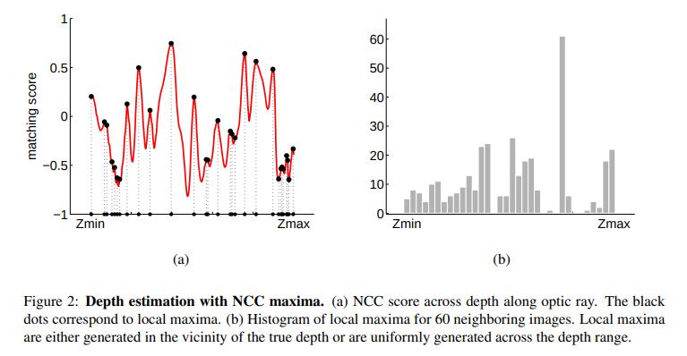
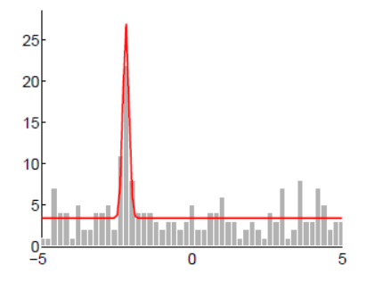

<!--
 * @Author: Liu Weilong
 * @Date: 2021-02-25 13:30:00
 * @LastEditors: Liu Weilong 
 * @LastEditTime: 2021-03-01 09:19:15
 * @FilePath: /3rd-test-learning/30. supplement_material/depth_filter/supplementary_material_depth_filter.md
 * @Description: 
-->
### 参考
https://www.cnblogs.com/ilekoaiq/p/8228324.html

遗留问题：
存疑的问题2

### 问题理解
输入：多次对于同一个KeyPoint 的深度观测 
输出：观测到的点是inliner的概率(这里的inlier 的意思是不是飞点之类的错误点)？真实深度是多少？() 

### 直觉
1. 直觉理解问题：一个在Camera 1 中的点p，往Camera j 当中进行投影，然后沿着极线进行块匹配搜索(NCC)，点p的深度(depth in Camera 1)从近到远，离散成50份，然后在极线上进行块匹配，统计得分。 
下图是在单张图像的搜索，另外一个是在Camera 1 附近60帧图像搜索的结果。 

可以发现还是会有有一个值特别突出。 
之后，为了计算的简便性我们只统计NCC response 最大的Z。 

2. 采样建模出概率分布：
这里相当于使用了采样的方法来寻找概率分布 
最后建模出来的内容就是： 

$$
\begin{aligned}
    &p(x_i|\hat{Z},\pi) = \pi N(x_i|\mu,\sigma^2) + (1-\pi)U(x_i|Z_{min},Z_{max})
    \\
    & p(\hat{Z}) \propto U
    \\
    & p(\pi) \propto U
\end{aligned}
$$

3. 目标问题：
$$
    \underset{\hat{Z},\pi}{\operatorname{argmax}} \pmb[\prod p(\hat{Z},\pi|x_i)\pmb]
    \\
\begin{aligned}
    &\prod p(\hat{Z},\pi|x_i)
    \\
    = & p(\hat{Z},\pi|X)
    \\
    \propto &p(X|\hat{Z},\pi)p(\hat{Z})p(\pi)
    \\
    \propto &p(X|\hat{Z},\pi)
    \\
    = &\prod p(x_i|\hat{Z},\pi)
\end{aligned}
$$
4. 例遍方法解决目标问题：将$Z_min$到$Z_max$分成50份，将$\pi$从0到1分成100份，进行例遍，求解找到让分布最大的值即可。实际上就是一个配置 $\hat{Z},\pi$ 让建模的分布和采样的部分相符合的过程。

### 迭代求解的方法
1. 直觉方法的问题：大量的计算，在实时计算上难以实施。所以需要寻找更好的方法->比如LM之类的方法？
2. 对于隐变量y的引入:重新看概率分布。
   $$
   \begin{aligned}
       &\prod p(x_i|\hat{Z},\pi)
       \\
       =&\prod \pmb[\pi N(x_i|\mu,\sigma^2) + (1-\pi)U(x_i|Z_{min},Z_{max})\pmb]
   \end{aligned}
   $$
   能够看出来，一旦展开求解，因为$\pi$ 并不是一个二值分布，而是一个均匀分布。而且公式不是一个纯高斯分布的乘法，使用优化的话并不能找到很好的方法。 
   在这种情况下，如果我们可以知道这次观测是一个好的观测，还是一个不好的观测就可以简化问题: 
    $$
    \begin{aligned}
       & p(x_i|\hat{Z},\pi)
       \\
       =& \sum^{y_i=[0,1]}p(x_i,y_i|\hat{Z},\pi)
       \\
       =& \sum^{y_i=[0,1]}p(x_i|y_i,\hat{Z},\pi)p(y_i|\pi)
       \\
       =& p(y_i=0|\pi)p(x_i|\hat{Z},\pi,yi=0)+
       p(y_i=1|\pi)p(x_i|\hat{Z},\pi,yi=1)
   \end{aligned}
   \\
   p(y_i|\pi) = \pi^{y_i}(1-\pi)^{1-y_i}
   \\
    p(x_i|\hat{Z},y_i,\pi) = N(x_i|\hat{d},\sigma^2)^{y_i}U(x_i)^{1-y_i}
   $$
   2021.2.26添加： 
   感觉这里实际上是实现了一个让分布从加法变成乘法的过程,并没有，这一句的理解是错的 
   y和$\pi$的关系还可以进行思考一下
3. 后验分布替换：引入y之后，再看$\prod p(\hat{Z},\pi|x_i)$
   $$
    \begin{aligned}
        &\prod p(\hat{Z},\pi|x_i)
        \\
        \propto &\prod p(x_i|\hat{Z},\pi)
        \\
        = & \prod \sum^{y_i=[0,1]}p(x_i|y_i,\hat{Z},\pi)p(y_i|\pi)

    \end{aligned}
    $$
    如果我们可以提前知道 这个点是不是一个好的测量，也就是y的话,会发现公式可以进一步简化
    $$
    \begin{aligned}
    &\prod p(\hat{Z},\pi|x_i)\rightarrow \prod p(\hat{Z},\pi|x_i,y_i)
    \\
    \propto & p(x_i|y_i,\hat{Z},\pi)p(y_i|\pi)
    \\
        = & \prod \pi^{y_i}(1-\pi)^{1-y_i}N(x_i|\hat{d},\sigma^2)^{y_i}U(x_i)^{1-y_i}
        \\
        = & \pi^{\sum y_i}(1-\pi)^{n-\sum y_i}U^{n-\sum y_i}N^{\sum y_i}
        \\
        \propto &\cfrac{\Gamma(n+2)}{\Gamma(\sum y_i+1)\Gamma(n-\sum y_i+1)}\pi^{\sum y_i}(1-\pi)^{n-\sum y_i}N^{\sum y_i}
        \\
        \downarrow &\sum y_i =s
        \\
        \propto & Beta(\pi|s+1,n-s+1) × Gaussian(\hat{Z}|\mu,\sigma^2)
    \end{aligned}
   $$
    最后，把$\prod p(\hat{Z},\pi|x_i,y_i)$ 转换成了一个Beta×Gaussian 的分布
4. 回顾：
   现在，先让我们看看，我们现在有了个什么样的结论：
   $$
   \begin{aligned}
           &\prod p(\hat{Z},\pi|x_i,y_i)
           \\
            \propto &\prod p(x_i|y_i,\hat{Z},\pi)p(y_i|\pi)
           \\
           \propto  &Beta(\pi|s+1,n-s+1) × Gaussian(\hat{Z}|\mu,\sigma^2)
   \end{aligned}

   $$
   也就是说，不管是 x+1次 还是x+n次，后验分布都是可以写成Beta×Gaussian 的形式的 
5. 迭代过程：从$p(\hat{Z},\pi|X_{n},a,b,\mu,\sigma,Y_n)$ 到 $p(\hat{Z},\pi|X_{n+1},a',b',\mu',\sigma',Y_{n+1})$
   $$
   \begin{aligned}
    &p(\hat{Z},\pi|X_{n+1},Y_{n+1})
    \\ 
    \propto &p(X_{n+1},Y_{n+1}|\hat{Z},\pi)
    \\
    \propto &p(x_i,y_i|\hat{Z},\pi)Beta(\pi|s+1,n-s+1) × Gaussian(\hat{Z}|\mu,\sigma^2)
    \\
    \downarrow & s+1=a,n-s+1=b
    \\
    \propto &p(x_i|\hat{Z},\pi,y_i)p(y_i|\pi)Beta(\pi|a,b) × Gaussian(\hat{Z}|\mu,\sigma^2)
   \\
   = &\pi^{y_i}(1-\pi)^{1-y_i}N(x_i|\hat{d},\sigma^2)^{y_i}U(x_i)^{1-y_i}Beta(\pi|a,b) × Gaussian(\hat{Z}|\mu,\sigma^2)
   \\
   = &Beta(\pi|a',b') × Gaussian(\hat{Z}|\mu',\sigma'^2)
   \end{aligned}
   $$
   

### 进一步拓展(好吧，我承认前面的东西好象是没有用了)
如果y我们不知道是不是外点怎么办？ 如果无法严格的判断一次
量是不是一个好的测量，那么我们就无法得到完美的Beta×Gaussian分布。只能近似。
步骤是：
1. 默认$p(\hat{Z},\pi|X_n)$符合Beta×Gaussian 分布
2. 进行迭代计算
   $$
   \begin{aligned}
    &p(\hat{Z},\pi|X_{n+1})
    \\
    =&p(x_{n+1}|\hat{Z},\pi)p(X_n|\hat{Z},\pi)
    \\
    =& \pmb[\sum^{y_i=[0,1]}p(x_i|y_i,\hat{Z},\pi)p(y_i|\pi)\pmb]Beta×Gaussian
    \\
    = & Beta_1×Gaussian_1 + Beta_2×Gaussian_2
   \end{aligned}
   $$
3. 通过计算 $Beta_1×Gaussian_1 + Beta_2×Gaussian_2$ 和$Beta_{target}×Gaussian_{target}$的一二阶矩，用$Beta_{target}×Gaussian_{target}$来近似$Beta_1×Gaussian_1 + Beta_2×Gaussian_2$

具体计算见depth_filter.pdf

### 存疑的问题 
1. 为什么可以通过一二阶矩进行近似？ 单峰似乎是可以的，但是多峰的情况呢？ 
答： 
   1.Beta×Gaussian是一个单峰二维分布。上面的近似满足条件$Beta_1×Gaussian_1 + Beta_2×Gaussian_2$ 和$Beta_{target}×Gaussian_{target}$的峰相差不远，可以近似出一个单峰分布。 
   2.一二阶矩的拟合构成的方程已经足够构造拟合Beta×Gaussian 
2. 为什么可以默认$p(\hat{Z},\pi|X_n)$符合Beta×Gaussian 分布？ 
2021.3.1添加 
突然发现，只要问题满足了1. 单峰拟合条件，就可以假设$p(\hat{Z},\pi|X_n)$符合Beta×Gaussian。也就在启发性的方面说明了，为什么可以这样进行拟合 
http://george-vogiatzis.org/publications/ivcj2010supp.pdf 推断的部分我没有看懂，存在知识点上的缺少，需要statistic inference chapter10.1的内容