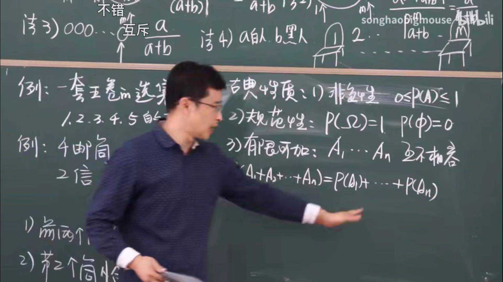
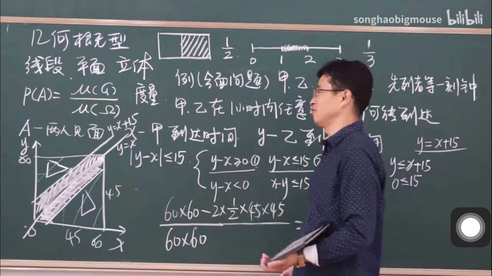
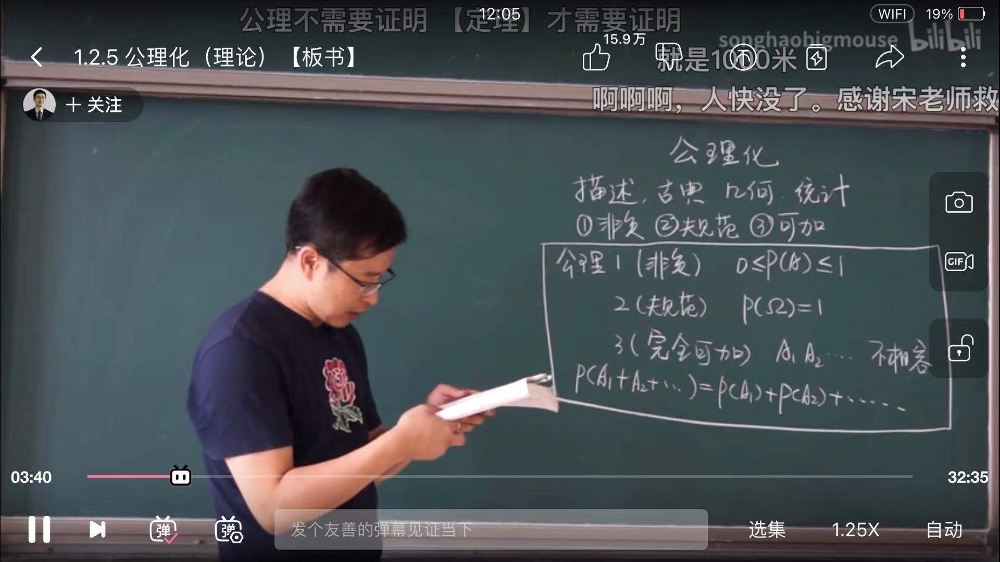

<!--
 * @Author: Liu Weilong
 * @Date: 2021-03-16 09:37:44
 * @LastEditors: Liu Weilong 
 * @LastEditTime: 2021-03-16 09:52:18
 * @FilePath: /3rd-test-learning/35. introduction_to_probability/song_hao/song_hao_chapter1.md
 * @Description: 
-->
### 基础概念
1. 基本事件：相对于观测目的，不可再分割事件。A
2. 复合事件：基本事件的复合
3. 样本空间：所有基本事件的集合 E
4. 空集：啥也没有集合$\phi$

### 事件关系
引入维恩图进行表示。
1. A+B 或
2. AB 并
3. A-B 
4. 对偶 

### 古典概率
1. 样本空间是一个可数的空间
2. 各种情况出现等概率
3. 数数：加法原则、乘法原则

### 几何概型
一般的情况，也就是各种线面
1. 各种情况出现等概率
2. 样本空间可以不可数
3. 各种算几何面积

### 频率和概率
1. $\omega()$ 表示频率 
2. $p()$ 表示概率
3. 概率是内部性质，频率是外部表现。频率和概率直接相关。

### 公理化
