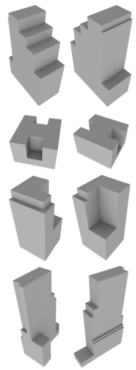
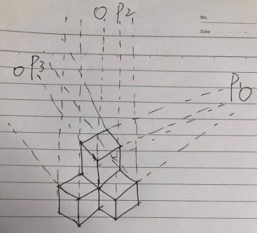

<!--
 * @Author: Liu Weilong
 * @Date: 2021-03-12 13:31:44
 * @LastEditors: Liu Weilong
 * @LastEditTime: 2021-03-27 17:28:39
 * @FilePath: /3rd-test-learning/38. line_feature/vanishing_point/doc.md
 * @Description: 
-->
### 目前留下来的问题：
1. Vanishing Point 的参数化? ok
2. Mahanttan World 是什么？ 基本进行了回答
3. Mahanttan Frame 是什么？ ok
4. 目前看来Mahanttan World是和面有关的，那么是如何引入的Vanishing Point的概念的呢？
5. Vanishing Point Pipeline 是什么？ ok

------
1. Vanishing Point 的参数化
2. Mahanttan World 是什么？
   小方块组成的世界，也就是两个相邻的面是垂直的世界。

   

   虽然现在世界上的很多东西，已经不是严格的Mahanttan世界了，但是这些物体都是可以近似成曼哈顿世界的。(类似我的世界)
   优点：可以处理缺少特征的对象，输出的内容非常干净
3. Mahanttan Frame 是什么？
   在论文中的定义是一个$S^2$的球体来进行表示优化$SO3$

4. Mahanttan World 和 VP 的关系？
   一开始认识mahanttan world 是基于面进行构建的，感觉和vanishing point 没有什么关系，但是如果用画画的想法来看，一切都会不一样
   
   
   4.a. 在Mahanttan World 中所有的线条都只和3个VP有关。
   4.b. 并且3个VP在多视图几何中对应的三维空间中的方向就是Mahanttan World 坐标系的方向.
   4.c. 严格的Mahanttan World中的平面都是由两个VP对应的平行线生成的。
   4.d. 不同的orthVPs(三个垂直的VP)，构成不同的mahanttan world
   
5. Vanishing Point Pipeline？
   5.a. first image
     a.1. LSD
     a.2. Parallel Cluster
     a.3. VP Init
   5.b. Second
     a.1. LSD
     a.2. Parallel Cluster
     a.3. VP Init 关于VP的参数化求解还是需要看一看
     a.4. Opt SO3
   不自己写一下是不会知道结果的

6. Vanishing Point RANSAC 方法 
   无信息的Vanishing 提取,使用2—Line in MW的方法 
   principle point:cx cy 
   
   

