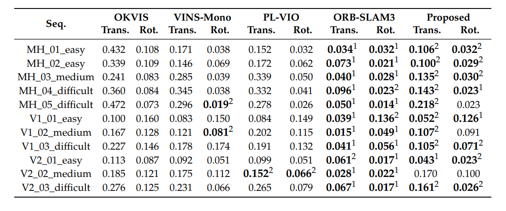
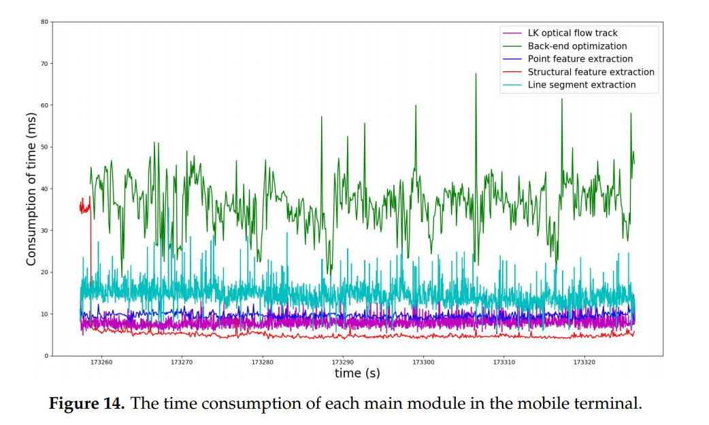
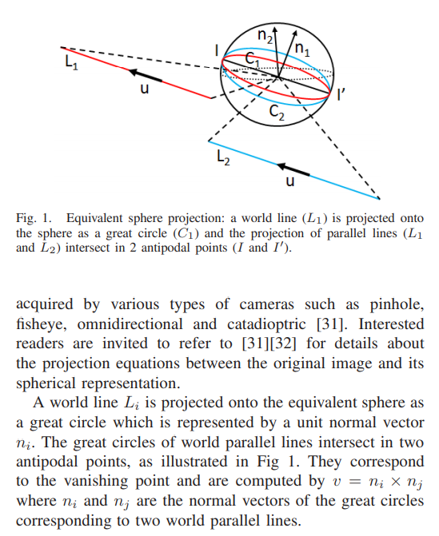
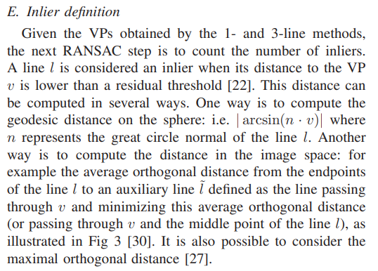

<!--
 * @Author: Liu Weilong
 * @Date: 2021-03-05 17:00:55
 * @LastEditors: Liu Weilong 
 * @LastEditTime: 2021-03-26 17:54:02
 * @FilePath: /3rd-test-learning/38. line_feature/vanishing_point/paper_reading.md
 * @Description: 
-->
### Vanishing Point(硬骨头)
序号|论文名|状态|备注
---|----|---|--
1. |Manhattan World: Compass Direction from a Single Image by Bayesian Inference|没读|最经常引用的文章，但是和我想要做的VP-SLAM并不是强相关 
2. |Real-time Manhattan World Rotation Estimation in 3D|没读|需要4. 的基础
3. |Manhattan-world Stereo|读了一部分(不继续读了)|目前唯一有点谱的文章，了解了MW到底是个什么东西。想到了VP和MW的关系
4. |The Manhattan Frame Model – Manhattan World Inference in the Space of Surface Normals |还要继续读|第二篇比较靠谱的论文 没看完，有点难
5. |Visual-Inertial Odometry of Smartphone under Manhattan World|还要继续读|比较完善的VP 在Local MW下的系统，但是在大系统下，肯定是有问题的，还是需要4.的MCMC进行亚特兰大世界的构建  22-28 vanishing point 的使用 29 就是说明rotation 是error的主要原因  vanishing Point 的提取 

----
1. Visual-Inertial Odometry of Smartphone under Manhattan World 效果惊人

### Paper Reading
1. 3-line RANSAC for Orthogonal Vanishing Point Detection
   笔记:
   a. 3VPs 不垂直的话，就要进行近似
   b. Gaussian Sphere 上，线会投影成一个Great Circle，相交于球的两个端点
      通过叉乘两个Great Circle上面的法向量，就可以得到一个Vanishing Point。
   
   大概思路:
   a. 初始化前，使用3-LINE RANSAC 做线的分类，inliner 判断两种。
   b. 初始化之后，使用3-LINE RANSAC 进行线分类。 只要一个方向固定，其他的都好说。
   c. inliners def
   
    
    因为RANSAC 从线得到的结果，所以不一定完全垂直

2. 
   