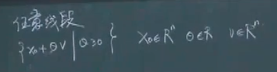
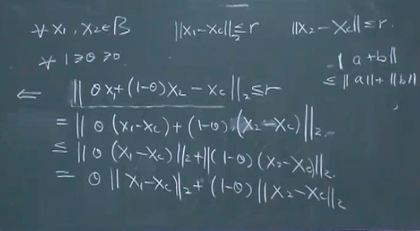
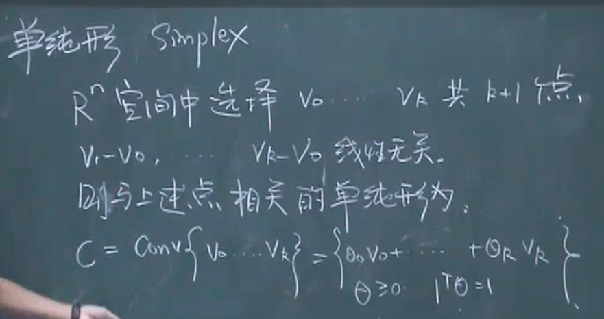
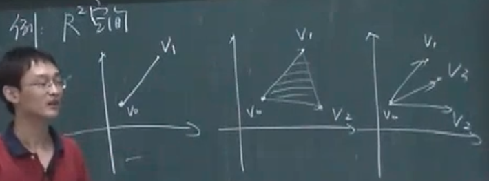
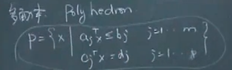
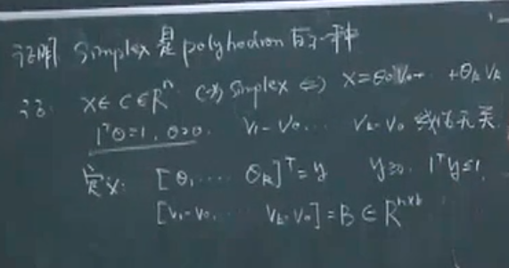
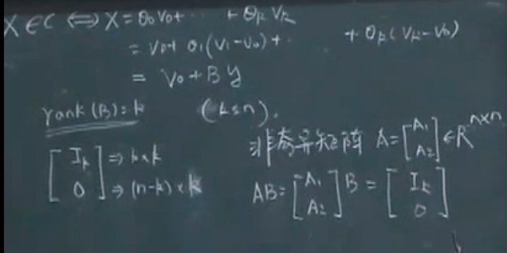
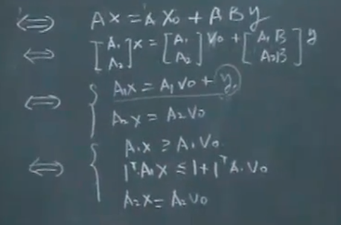

<!--
 * @Author: Liu Weilong
 * @Date: 2021-05-30 09:38:00
 * @LastEditors: Liu Weilong
 * @LastEditTime: 2021-06-19 17:46:48
 * @Description: 
-->
### 例子 主要目的是加深理解

小结:
1. 几种重要的凸集 R^n 和 R^n的子空间、 任意线段、超平面和半空间、球和椭球、单纯形、多面体、对称矩阵
---
### 几种重要的凸集

2. 任意线段
   

   $x_o =0$ 凸锥
3. 超平面
   
   $x = {x|a^Tx=b}$

   半空间

   $x = {x|a^Tx>b}$

   均为凸集

4. 球

    $Q = {x|||x-x_c||_2<= r}$

    如何证明呢？这里开始说明重点，如果给一个集合如何证明他是一个凸集

    实际上只要证明

    $$
    y = \theta_1x_1+\theta_2x_2,\theta_1+\theta_2 = 1
    \\
    y\in Q
    $$
    即可

    

    椭球

    $Q = {x|(x-x_c)^TP^{-1}(x-x_c)<= r},P\in S_{++}$

5. 单纯形

    

    会发现单纯形实际上是一个凸组合，
    
    但是一个凸包是不是一定是一个单纯形呢？
    并不是，R^2 里面的单纯形只能是一个三角形
    R^3 里面的单纯形只能是一个四面体

    形状被线性无关这个条件被压死了

    

6. 多面体

    能看出看 多面体其实是多个半空间和超平面的交集
    

   一个单纯形一定是一个多面体。但是多面体不一定是单纯形

    其实从直观上来说的话一定是对的，但是从逻辑证明上还是比较绕，所以直接放截图了

    
    
    

    y实现等号到不等号的转变

    并且很容易忘记 实际上y还存在一个这样的非常"凸"的性质

    $y_i<=1 ,i <=n$

    A也是比较容易构造出现的

7. 对称矩阵
    