<!--
 * @Author: Liu Weilong
 * @Date: 2021-06-24 21:37:40
 * @LastEditors: Liu Weilong
 * @LastEditTime: 2021-06-26 14:26:28
 * @Description: 
-->
### 凸函数

1. 凸函数定义
2. 拓展值函数
3. 凸函数判定条件
4. 一些常见凸函数
5. SubLevel Set 子水平集

----
1. 凸函数定义:

    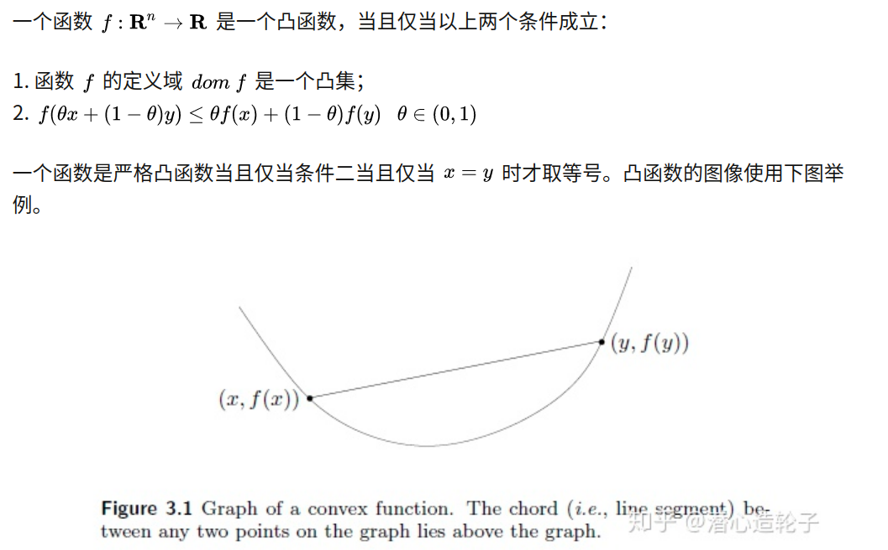

    凹函数定义:

    $$
    f(\theta x + (1-\theta)y) >= \theta f(x) + (1-\theta)f(y)
    $$

    仿射函数 是既凸又凹的

    ie.
    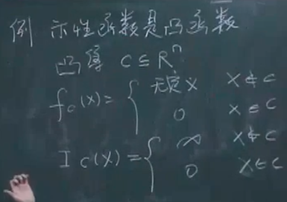
    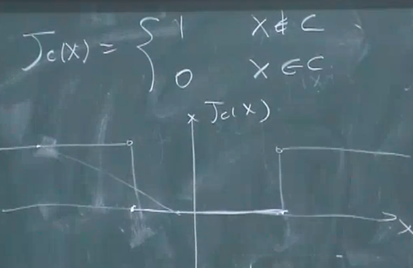

    多种定义：

2. 拓展值函数
   
   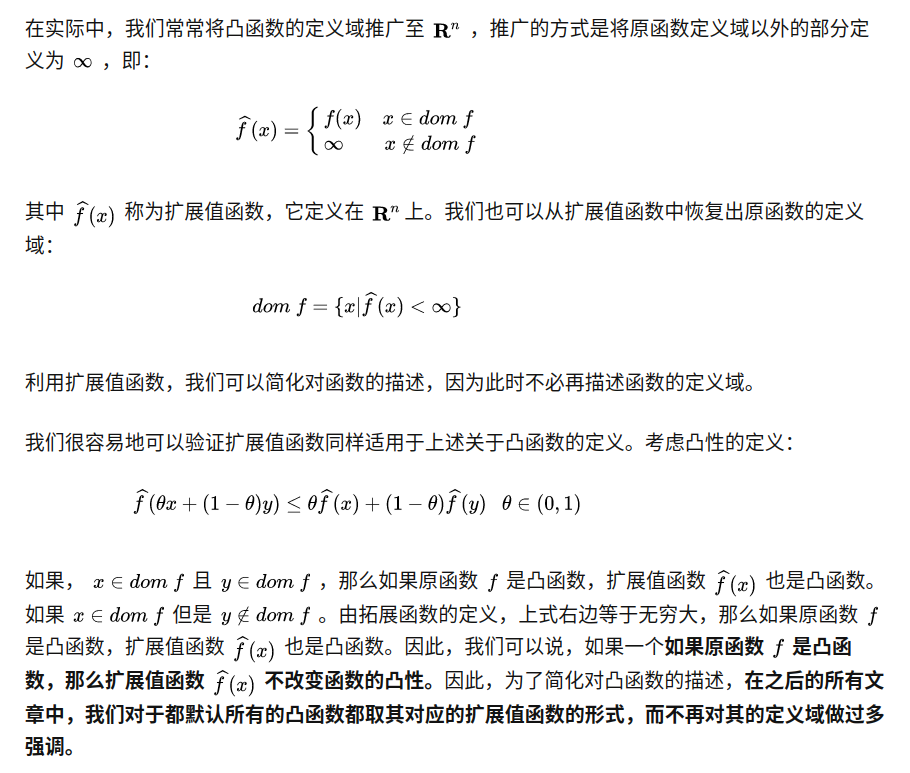

   但是这个扩展的性质只对 $\infin$有用。 如果不是 $\infin$ 就会变成和 1. 中的示性函数的例子那样(取1)，函数丧失凸性

3. 凸函数判定条件

    一阶条件

    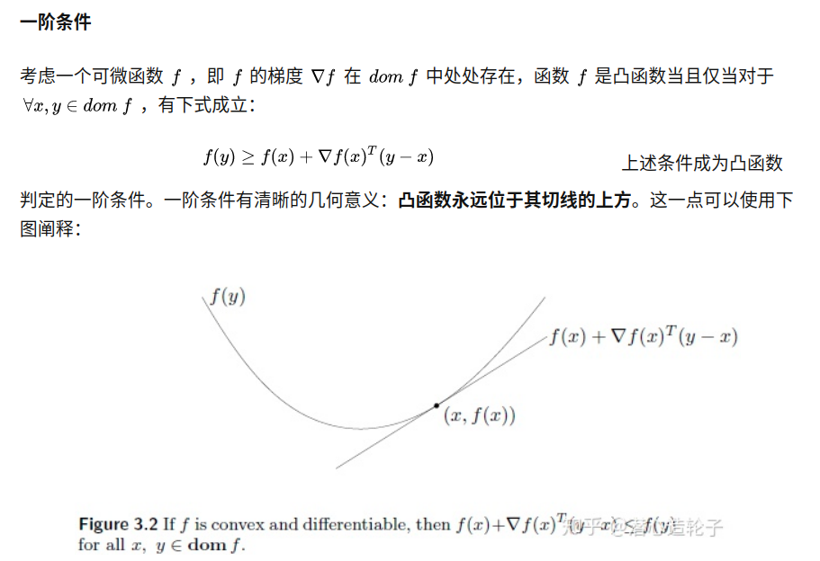
    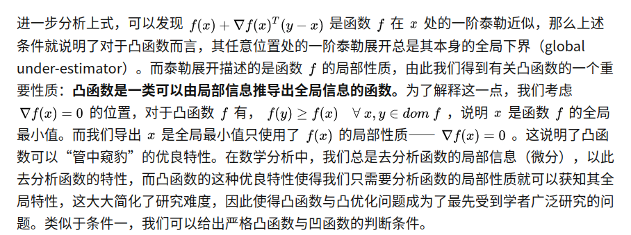

    这里同时也说明 f 的定义域必须是一个开集，如果是闭集在边界上不可微

    实际上，这个也是一个凸函数的定义

    二阶条件

    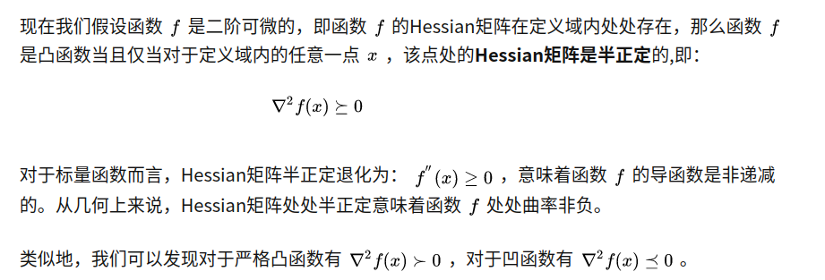

4. 一些常见凸函数

    标量:
    
    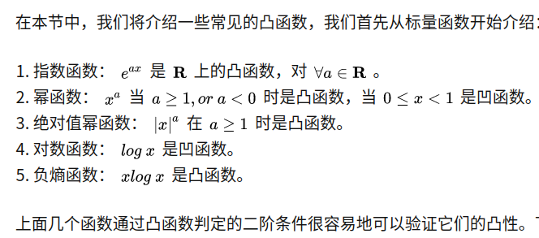

    矢量:
    
    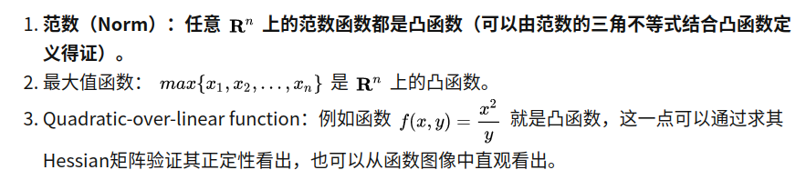
    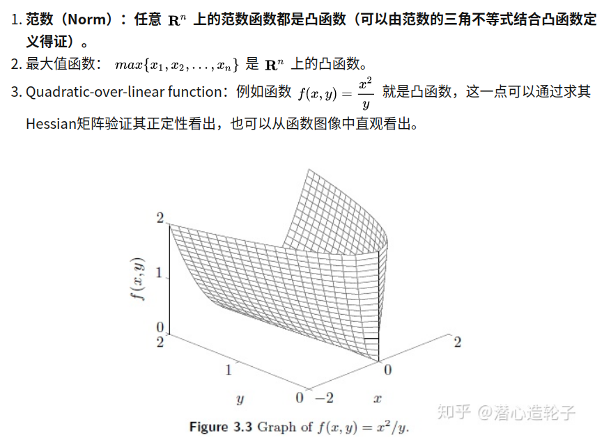
    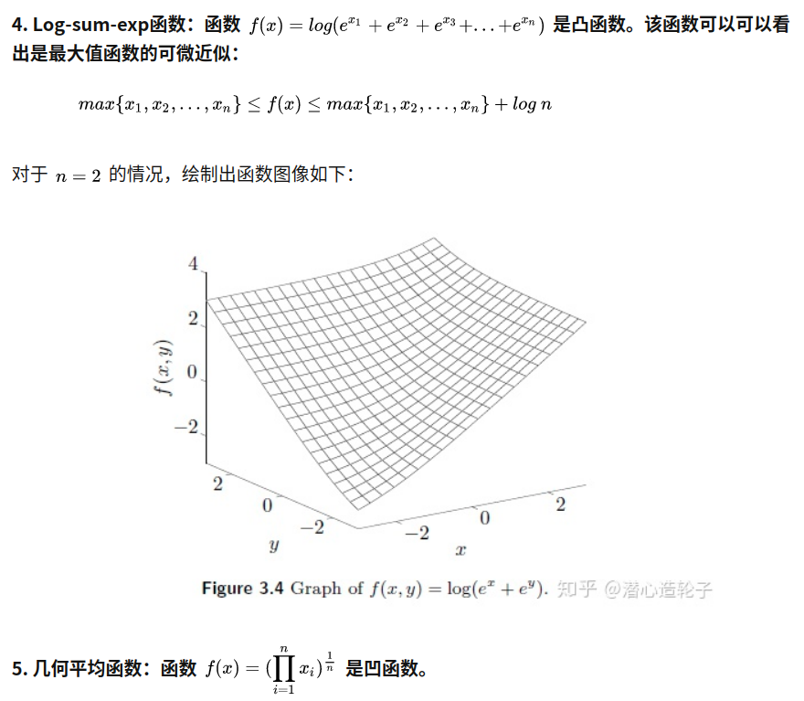
    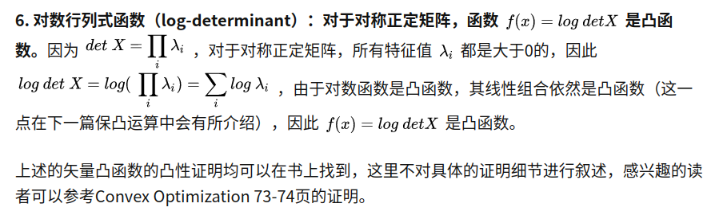

5. SubLevel Set 子水平集

    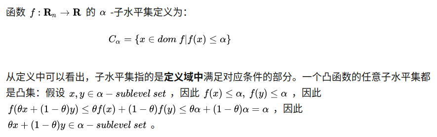
