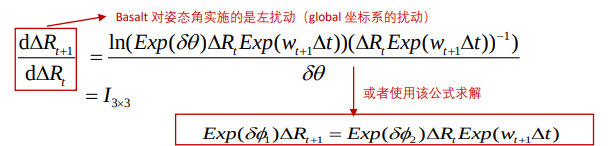
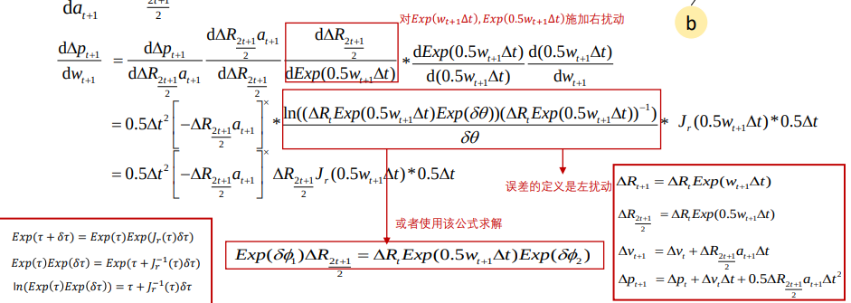
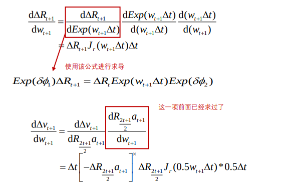

<!--
 * @Author: Liu Weilong
 * @Date: 2021-05-10 08:56:51
 * @LastEditors: Liu Weilong 
 * @LastEditTime: 2021-05-10 17:10:45
 * @FilePath: /Codes/47. basalt/code/imu.md
 * @Description: 
-->
### BASALT_IMU 代码过程
1. KeypointVioEstimator-> imu initialize() 进行初始化
   |__ 静止初始化
2. feed_imu
3. IntegratedImuMeasurement -> prograte
   |__ integrate()

 2021.3.10 添加 
如何正确理解 state 和 error state?
error state 是一种补充，也就是在state的存在噪声或者建模不佳的时候，对state 正确结果的补充内容。

可以说 state 是一个常量， 而 error state 是一个变量，包含均值和方差

所以我们在进行状态方差分析的时候，才会在 error state 上进行。 进一步讲 error state + state 才是 我们真实的state 变量

这个是从VINS 的预积分思想上进行的。

### BASALT IMU 迭代
1. 状态迭代 就是正常的进行
   $$
    \Delta R_{t+1} =\Delta R_{t+\Delta t}= \Delta R_texp(\Delta t*\omega) \\
    \Delta R_{\frac{\Delta t}{2}+t} = \Delta R_t exp(\cfrac{\Delta t}{2}\omega)\\
    \Delta v_{t+1} = \Delta v_{t+\Delta t} = \Delta v_t + \Delta R_{\frac{\Delta t}{2}+t} a \Delta t\\
    \Delta p_{t+1} = \Delta p_{t+\Delta t} = \Delta p_t + \Delta v_t \Delta t + \cfrac{1}{2}\Delta R_{\frac{\Delta t}{2}+t} a \Delta t^2\\
    \Delta S = \left[
        \begin{matrix}
            \Delta R \\
            \Delta v \\
            \Delta p
        \end{matrix}
        \right]
   $$
2. 方差迭代
   $$
    \Delta S_{t+1} = f(\Delta S_t,\omega,a)\\
    \Delta S_{t+1} + \delta \Delta S_{t+1} = f(\Delta S_t + \delta \Delta S_t,\omega+\delta \omega , a + \delta \omega)\\
    \delta \Delta S_{t+1} = \cfrac{\partial f(\Delta S_t,\omega,a)}{\partial \Delta S}\delta \Delta S_t + \cfrac{\partial f(\Delta S_t,\omega,a)}{\partial \omega}\delta \omega +
    \cfrac{\partial f(\Delta S_t,\omega,a)}{\partial a}\delta a
   $$

   JACOBIAN $\Delta S$: 
    
   $$
   \begin{aligned}
    \left[
        \cfrac{\partial f(\Delta S_t,\omega,a)}{\partial \Delta S}
        \right]
        &= 
        \left[
        \begin{matrix}
            \cfrac{\partial f(\Delta S_t,\omega,a)}{\partial \Delta p}\\
            \cfrac{\partial f(\Delta S_t,\omega,a)}{\partial \Delta v} \\
            \cfrac{\partial f(\Delta S_t,\omega,a)}{\partial \Delta R}
       
        \end{matrix}
            \right]^T
    \end{aligned}
    $$
    Position:
    $$
    \begin{aligned}
    \cfrac{\partial f(\Delta S_t,\omega,a)}{\partial \Delta p} &=
     \left[
        \begin{matrix}
            \cfrac{\partial \Delta p_{t+1}}{\partial \Delta p_t}\\
            \cfrac{\partial \Delta v_{t+1}}{\partial \Delta p_t} \\
            \cfrac{\partial \Delta R_{t+1}}{\partial \Delta p_t}
       
        \end{matrix}
            \right]
            =
             \left[
        \begin{matrix}
            I ^{3×3}\\
            0 ^{3×3}\\
            0^{3×3}
        \end{matrix}
            \right]    
   \end{aligned}
   $$   
   Velocity:
    $$
    \begin{aligned}
    \cfrac{\partial f(\Delta S_t,\omega,a)}{\partial \Delta v} &=
     \left[
        \begin{matrix}
            \cfrac{\partial \Delta p_{t+1}}{\partial \Delta v_t}\\
            \cfrac{\partial \Delta v_{t+1}}{\partial \Delta v_t} \\
            \cfrac{\partial \Delta R_{t+1}}{\partial \Delta v_t}
       
        \end{matrix}
            \right]
            =
             \left[
        \begin{matrix}
            I ^{3×3} \Delta t\\
            I ^{3×3}\\
            0^{3×3}
        \end{matrix}
            \right]    
   \end{aligned}
   $$   
   Rotation 左乘更新:
$$
    \begin{aligned}
    \cfrac{\partial f(\Delta S_t,\omega,a)}{\partial \Delta R} &=
     \left[
        \begin{matrix}
            \cfrac{\partial \Delta p_{t+1}}{\partial \Delta R_t}\\
            \cfrac{\partial \Delta v_{t+1}}{\partial \Delta R_t} \\
            \cfrac{\partial \Delta R_{t+1}}{\partial \Delta R_t}
       
        \end{matrix}
            \right]
            =
             \left[
        \begin{matrix}
            - \cfrac{1}{2} \Delta t^2 [\Delta R_{\frac{\Delta t}{2}+t} a]^×\\
            -\Delta t [\Delta R_{\frac{\Delta t}{2}+t} a]^×\\
            I^{3×3}
        \end{matrix}
            \right]    
   \end{aligned}
   $$   
2021.5.10添加 
之前，关于ESKF 如何更新的问题，现在逐渐变得清晰 

如果 error state 是左乘在 state 进行误差状态分析，那么更新的时候进行左乘。

如果上面是右乘，那么更新的时候就进行右乘。

好像不太对啊！！ 之后还是要再看看

发现了一个很不同的地方

和我想的求导不太一样
我的想法
$$ 
\cfrac{d\Delta R_{t+1}}{d\Delta R} = \cfrac{In(exp(\delta \theta) \Delta R_t exp(\omega \Delta t))-In( \Delta R_t exp(\omega \Delta t))}{\partial \delta \theta}\\
=J_l^{-1}(\Delta R_t exp(\omega \Delta t))
$$
这样的话差的就有点大了
存疑，之后去问一下

   

Tips: 经过观察 BASALT 的 state 的存储顺序应该是 

Position Rotaion Veloctiy

JACOBIAN $a$:
$$
    \begin{aligned}
    \left[
        \cfrac{\partial f(\Delta S_t,\omega,a)}{\partial a}
        \right]
        &= 
        \left[
        \begin{matrix}
        \cfrac{\partial \Delta p_{t+1}}{\partial a}\\
            \cfrac{\partial \Delta v_{t+1}}{\partial a} \\
            \cfrac{\partial \Delta R_{t+1}}{\partial a}
       
        \end{matrix}
            \right]
        =\left[
        \begin{matrix}
        0.5 \Delta R_{\frac{\Delta t}{2}+t}\Delta t ^2\\
            \Delta R_{\frac{\Delta t}{2}+t}\Delta t \\
            0^{3×3}
       
        \end{matrix}
            \right]
    \end{aligned}
$$

JACOBIAN $\omega$
$$
    \begin{aligned}
    \left[
        \cfrac{\partial f(\Delta S_t,\omega,a)}{\partial \omega}
        \right]
        &= 
        \left[
        \begin{matrix}
        \cfrac{\partial \Delta p_{t+1}}{\partial \omega}\\
            \cfrac{\partial \Delta v_{t+1}}{\partial \omega} \\
            \cfrac{\partial \Delta R_{t+1}}{\partial \omega}
       
        \end{matrix}
            \right]
    \\
    \cfrac{\partial \Delta p_{t+1}}{\partial \omega} & = \cfrac{\partial 0.5 \Delta R_{\frac{\Delta t}{2}+t}a\Delta t^2}{\partial In(\Delta R_{\frac{\Delta t}{2}+t})} \cfrac{\partial In(\Delta R_{\frac{\Delta t}{2}+t})}{\partial 0.5\omega\Delta t}\cfrac{\partial 0.5\omega\Delta t}{\partial \omega}
    \\
    &中间的jacobian使用左乘模型
    \\
    & = -0.5\Delta t^2 [\Delta R_{\frac{\Delta t}{2}+t}a]^××J^{-1}_r(In(\Delta R_{\frac{\Delta t}{2}+t}))exp(-0.5\omega\Delta t)×0.5\Delta t  
    \end{aligned}
$$
中间 的jacobian 使用右乘模型+ 有点奇怪的求导方式

需要之后去确认一下。

考虑 bias

### 遗留问题
1. Bias 的求导
2. 位姿图优化的问题 位姿图优化测试
3. 误差参数是不是随处可放，也就是随意左乘右乘都可以
4. D-EKF的问题

