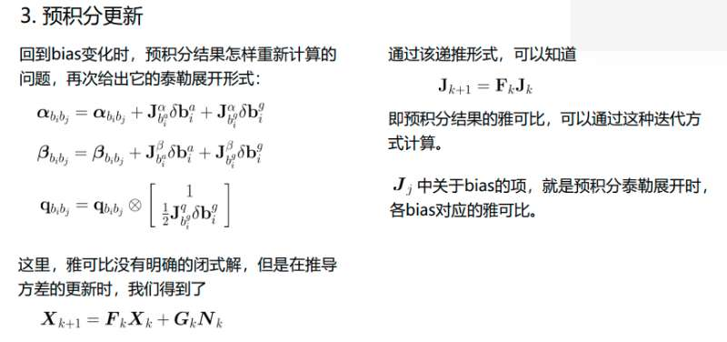
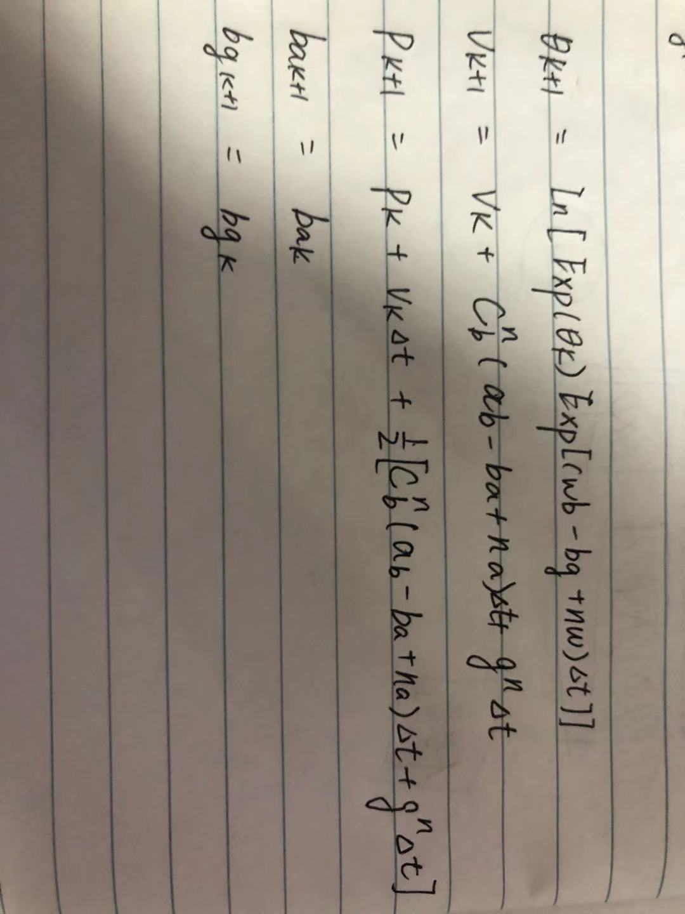
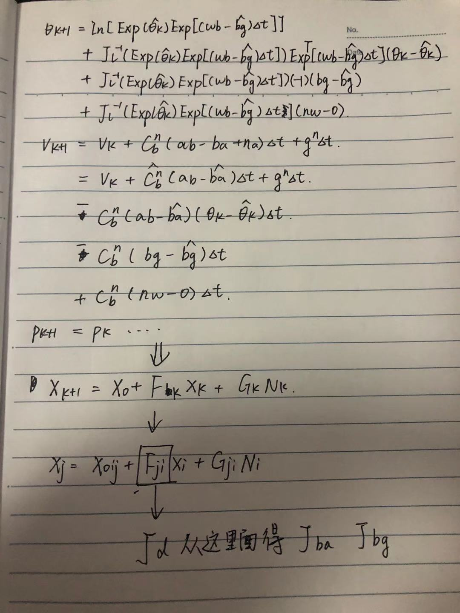

#### 关于预积分的Ba Bg

关于$J_{ba}$ 和 $J_{bg}$的问题，在这里得到了解释。 
之前对于$J_{ba}$ 和 $J_{bg}$ 的理解存在一些问题。 
主要是因为  
     1. 预积分递推有一个用于迭代的J  
         2. 方差估计使用误差分析的时候还有一个迭代的J(部分文档) 
存在多个J 的情况下，有些时候会搞混。这里就是很明显的说明了，
$J_{bg}$和$J_{ba}$都是来自于预积分递推的J。如上图所示。 
每一个IMU 数据的递推 
$X_{k+1} = F_kX_{k} + G_{k}N_{k}$ 
$J_{k+1} = F_{k}J_k$  
最后一个IMU预积分 
$X_{j} = J_{ji}X_{i} + G_{ji}N_i$ 
$J_{bg}$和$J_{ba}$ 都是来自$J_{ji}$ 
&thinsp;&thinsp;&thinsp;&thinsp;&thinsp;&thinsp;&thinsp;&thinsp;&thinsp;&thinsp;&thinsp;&thinsp;&thinsp;&thinsp;&thinsp;&thinsp;&thinsp;

