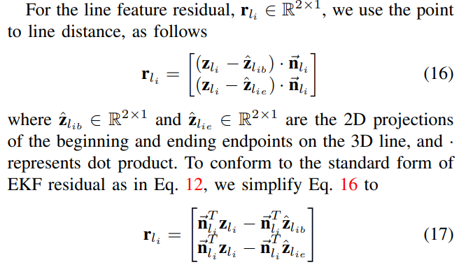
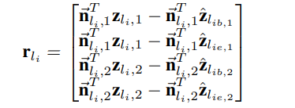

### MSCKF

1. Trifo-VIO: 
Trifo-VIO: Robust and Efficient Stereo Visual Inertial Odometry using
Points and Lines 

    摘要： 
    1.  点、线MSCKF
    2.  有了个轻量级的回环框架。
   
    内容：   
    1. 线的参数化
    
    图像上，线的参数化采用，一个线上的点$z_{li}$和垂直于线的单位向量$\vec{n_{li}}$。 
    两个三维空间点，约束一条线。然后用线构建一个$R^{2×1}$ 的投影误差即可。 
    $z_{li}$ 是图像上在这个线上的随意一个点。 
    思想上就还是通过重投影之后的线和$\vec{n_{li}}$ 的点积为0 
    从单目，拓展到双目。
    
    猜测EKF 更新方法和MSCKF 一致 最后确实是 MSCKF 的去除feature state的方法
    2. 回环 
    ORB描述子做会换
    3. 图像处理 
    点 KLT+FAST  线LSD+LBD 线的匹配也是使用LBD 进行匹配 
    mean brightness check + histogram matching 克服自动曝光
    