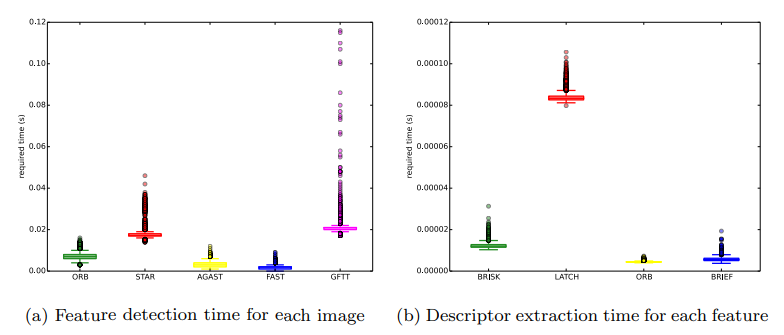
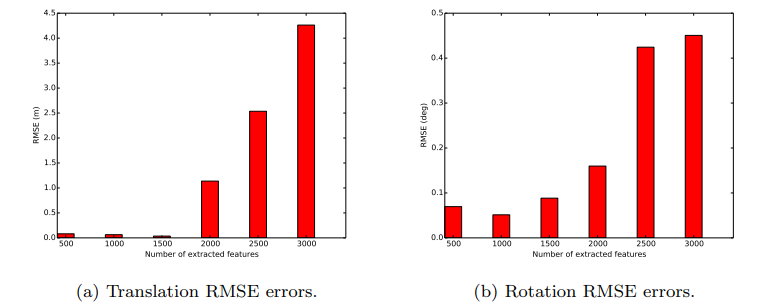
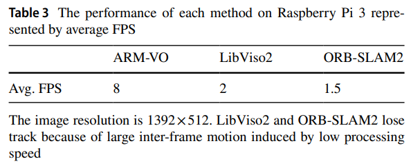
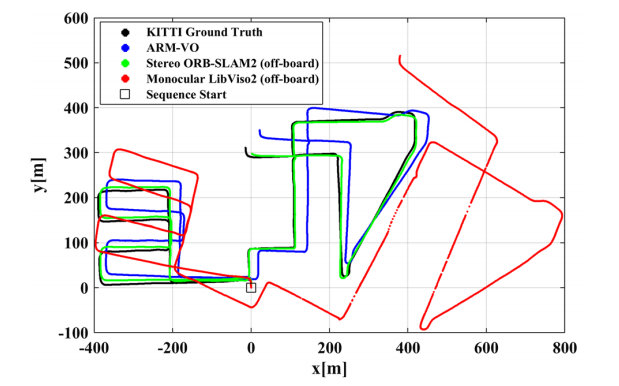
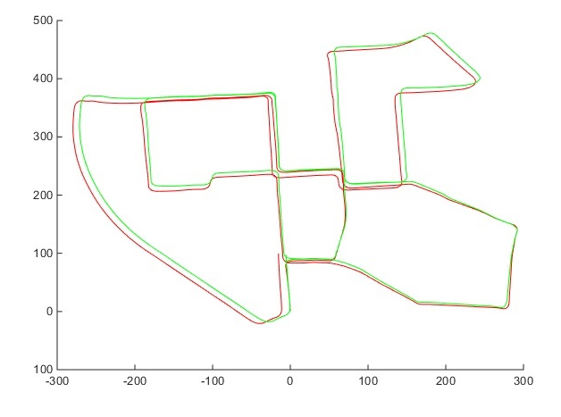
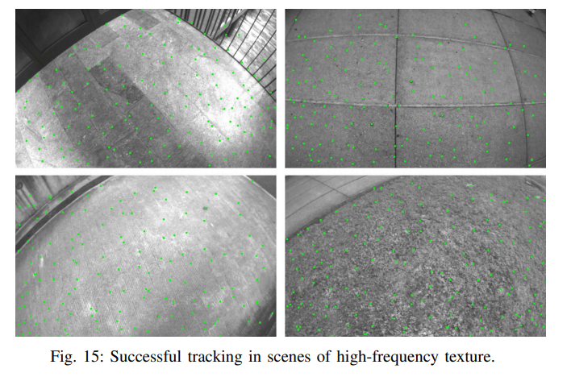
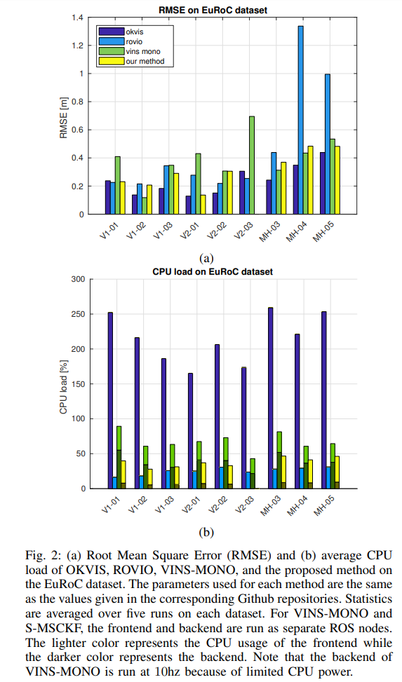

论文集来源
https://zhuanlan.zhihu.com/p/115599978/  吴艳敏

## 传统SLAM： 特征点、半直接、直接法

### Feasure_based

#### S-PTAM(双目 PTAM) 

   S-PTAM: Stereo Parallel Tracking and Mapping
   
   摘要： 
   1.对多种环境鲁棒：室内、室外、动态物体、光环境、大回环、高速运动 
   2.对多种Feature和Descriptor的测试。 
   3.一种新的初始化方法

   内容： 
   1.特征点测试了多种 
   2.DeadReckon+PnP 前端 ScanToMap 
   3.Local Map BA ScanToMap 
   4.回环BoWds(Apperance) + P3P+内点数量检测(Geometric Verification) 
   5.相关实验结果： 
   Feature 和 Descriptor 计算时间
   
   Error 和 特征提取量的关系
   

   总结： 
   中规中距的SLAM算法，对于所说的鲁棒性没有看到源码前，表示怀疑。 
   ORB 的提取速度已经意外的快了。 
   令人意外的是特征点的数量并不是越多越好，怀疑是引入误匹配的原因。 

   开源： 
   https://github.com/lrse/sptam

#### ARM‑VO (Mono)

   ARM‑VO: an efcient monocular visual odometry for ground vehicles
on ARM CPUs

   摘要： 
   在Rasperry 3B上，可以实时跑的VO。

   内容： 
   a.并行网格Fast特征提取 
   b.并行KLT追踪 
   c.特征点矫正 
   d.F和H+RANSAC+GRIC[1](模型选择) 这里选的是一个rough H 
   e.H的快速estimation[2] 
   f.多线程RT验证 
   g.Scale resolving 没看懂

   实现： 
   a.KLT 用 OpenCV 有Neon C 加速 TBB 
   b.FAST 从 OpenCV 的SSE2 换成NEON Fast Threshold 是15 TBB 
   c.H 计算和check OpenMP 
   d.对OpenCV源代码进行了更改,删除 check 和 double->float

   效果：
   
   

   引用： 
   [1]GRIC：An assessment of information criteria for motion model
selection. In: 1997 IEEE Computer Society Conference on Computer Vision and Pattern Recognition. Proceedings. IEEE 
   [2]Márquez-Neila, P., et al.: Speeding-up homography estimation
in mobile devices. J. Real Time Image Process. 

   总结： 
   速度快，但是精度有限。GRIC用于选择HF模型需要看一下

   开源： 
   https://github.com/zanazakaryaie/ARM-VO

### Semi-Direct

#### SVO/SVO2 (Mono/Stereo)
   
   SVO: fast semi-direct monocular visual odometry SVO  
   SVO: Semi-Direct Visual Odometry for Monocular
and Multi-Camera Systems 

   摘要： 
   Feature + PLK
   
   内容： 
   a. 栅格FAST提取 (网友说有提取策略有一些问题) 
   b. Direct法 构建光度误差进行匹配(网友说初始化有光流) 
   c. FrameToFrame 之后 FrameToMap (一个inverse_xxx 的操作 计算Jacobian加速) 
   d. 因为单木的尺度未知，在地图线程有一个深度滤波(难点，网友说深度不容易收敛)

   开源: 
   https://github.com/HeYijia/svo_edgelet  
   贺一家修改的SVO 版本 
   https://github.com/uzh-rpg/rpg_svo_example  
   用于SVO2.0 的使用 SVO2.0 只有Binary文件 
   https://github.com/uzh-rpg/rpg_svo  
   SVO1.0 阉割版源码 

   Tips: 
   网友修改过后的SVO1.0 还是有潜力的
   
   
   看论文效果感觉也不是完全的栅格提取

### Direct

#### DSO(Mono)/LDSO
   
   Direct Sparse Odometry
   LDSO: Direct Sparse Odometry with Loop Closure
   摘要： 
   感觉是添加了光度参数的直接法。 
   LDSO 则是使用词袋进行回环提取。 
   开源： 
   https://github.com/JakobEngel/dso  
   https://github.com/tum-vision/LDSO

#### DSM
   Direct Sparse Mapping

--- 刷到10 

## VIO

#### MSCKF 
   A Multi-State Constraint Kalman Filter
for Vision-aided Inertial Navigation

#### MSCKF2.0

#### MSCKF_vio(Stereo + IMU)
   Robust Stereo Visual Inertial Odometry for Fast
Autonomous Flight

   摘要： 
   和别的VIO 框架一致，但是低算力，高稳定性

   内容： 
   a. 

   引用: 
   a. VIO 四个自由度优化分析： 
   [1] M. Li and A. I. Mourikis, “High-precision, consistent ekf-based visualinertial odometry,” The International Journal of Robotics Research,
vol. 32, no. 6, pp. 690–711, 2013. 
   [2]G. P. Huang, A. I. Mourikis, and S. I. Roumeliotis, “Observability-based
   rules for designing consistent ekf slam estimators,” The International
   Journal of Robotics Research, vol. 29, no. 5, pp. 502–528, 2010.

   效果： 
   quad-core i76770HQ 2.6Hz. 20HZ 的Stereo 和200 HZ的IMU 
   

   看起来 OKVIS 基本不用看了 ROVIO 可以看一下 S-MSCKF 效果还是不错的
   开源： 
   https://github.com/KumarRobotics/msckf_vio

   总结： 
   阅读相关内容需要看一下MSCKF，MSCKF2.0，看视频效果确实不错。不知道真实跑是什么样子

## 深度学习SLAM
