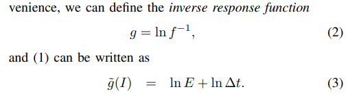
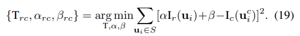
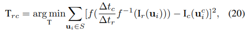
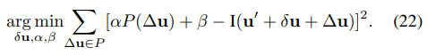
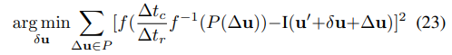

<!--
 * @Author: Liu Weilong
 * @Date: 2021-04-21 18:04:50
 * @LastEditors: Liu Weilong 
 * @LastEditTime: 2021-04-21 18:24:50
 * @FilePath: /Codes/doc/paper/paper-21.4.20-21.4.30/doc.md
 * @Description: 
-->
1. Active Exposure Control for Robust Visual Odometry in
HDR Environments

内容:
a. 光度标定 f photometric reponse 函数的逆函数 $In f^{-1}$

b. 进行光照控制 通过之前定义的四种代价项，对$\Delta t$求导
得到最佳$\Delta t$
c. 光照补偿
直接法

光流

d. 其余参数调节，见论文 Implement Detail
