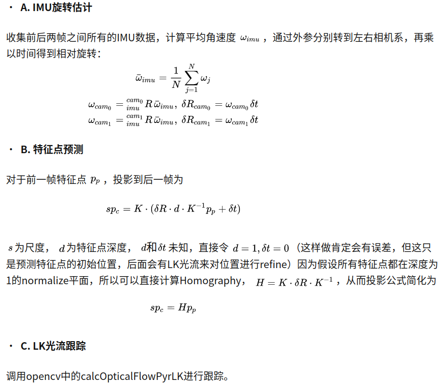

## VIO 好效果重点

### FrontEnd Feature

#### 初始化
   1. "Closed-form solution of visual-inertial structure from
motion"   
按照VI-DSO Mono-IMU 初始化的问题已经是一个研究的很好的问题了，那么现在进行初始化的方向就是看哪个初始化的快？ 

#### Point Feature-Based
   1. 网格的划分与特征提取： 
      现在一般采用的方法是 恒定均与划分 然后使用NMS 使其均匀和稀疏  
      但是根据目前的信息来讲 
      并不建议这样的方式，因为有些场景下会存在大空白(ie. 天空)的情况，这种情况会导致特征点数量不足的情况。 
      最终影响到累计误差的情况。 
      所以可能 四叉树 这一类的自适应网格效果会更好？ 之后再试试 
      框架实现： 
      a. (S-MSCKF) 4×5 个格子进行特征提取每个不超过4个特征点。可以很简单实现自适应提取恒定个点的算法。
   2. 特征点数量 过多过少都有问题
      从 S-PTAM 的实验结果中可以知道，特征点过多和过少都会对定位结果有不好的影响。 
      点多的话 可能会误匹配？ 
      点少的话 是因为什么呢？ 
      这个特征点数量的调整可能还是要放在具体的环境里进行调参才可以了

#### 光流/Direct 

   1. Data Assoicate 的问题 
      光流和 直接法 出现的误匹配的情况会更加严重(运动模糊、非全局曝光 等多种原因)，所以对于初始位姿的要求会更高。 
      感觉是不是如果相机的处理频率更高就会有一些好的改善？ 
      框架实现： 
      a. (Direct、LK方法都有)金字塔 
      最多的处理方法是就是金字塔,觉得是害怕无匹配，现在看更多是避免大运动的情况 
      b. (DSO)邻域匹配 
      另外一种就是直接使用周围一圈的点的进行匹配(SVO/DSO貌似都有这种操作，留给之后进行探索吧) 圆圈的大小，肯定是会和概率相关的 
      c. (Direct、LK 都有相应的使用)跟踪点均匀化 
      均匀化和 Feature-Based 的方法可能有一些相关性
      d. (S-MSCKF) 外点剔除 
      用于LK 之后，已经有了匹配的点对之后 
      如果有平移的话 通过极线做RANSAC，去除外点。 
      如果没有平移，极线约束退化，直接使用点的旋转来进行外点去除 
      RANSAC在内部左右图像匹配使用，和前后帧匹配上使用了2-Point Ransac 
   2. FAST和gradient的选择 
      追踪可以是FAST又可以是gradient 的点 
      关于如何选择，如何混合，选择多少，DSO的 Parameter Study可以提供一些思路
   3. 光度标定 
      从DSO那里可以得知，有没有光度标定。光度不变假设的符合性对于光度衡量类算法的影响 
      也可以从硬件方式上面解决？ 
      也可以自动调节曝光 
      ->Active Exposure Control for Robust Visual Odometry in
HDR Environments 
      2017 年的文章差距真的太大了 真正的植根于硬件来做算法
   4. IMU 
      IMU是否可以算作匹配初值来进行使用，从而加速匹配 
      框架实现： 
      a. (S-MSCKF) IMU旋转做LK初值 
      S-MSCKF已经在使用这种预测了，但是imu在gyro上更加可信所以只是做了旋转上的预测。很容易想到拓展到轮子上。 
      这个对于LK光流 对于 直接法 都有启示。 
      对于线面等高级特征的匹配似乎意义更大。因为更高级的特征就意味着需要对更多维度进行搜索。 
      
      猜想： 
      a. IMU 数据和LK结合的时候，是不是可以根据方差来选择匹配的金字塔层数？ 
      b. 这个方法对于雷达的特征匹配是不是也有一定的指导性作用？ 
      使用IMU的累计均值和方差确定匹配的初始位置和搜索范围 
   5. 融合时 更好的光度误差模型建模 
      将论文中需要调参的lamda 换成一个从误差模型得到的参数会不会更好？ 
 
   
### FrontEnd SlideWindow

   1. SlideWindow的策略制定会对算法有影响
      DSO   

## Lidar 好效果重点

### FrontEnd
   1. 点云匹配之后，再加一个IMU修正。 
      据说效果会更好?没有理明白这个逻辑     